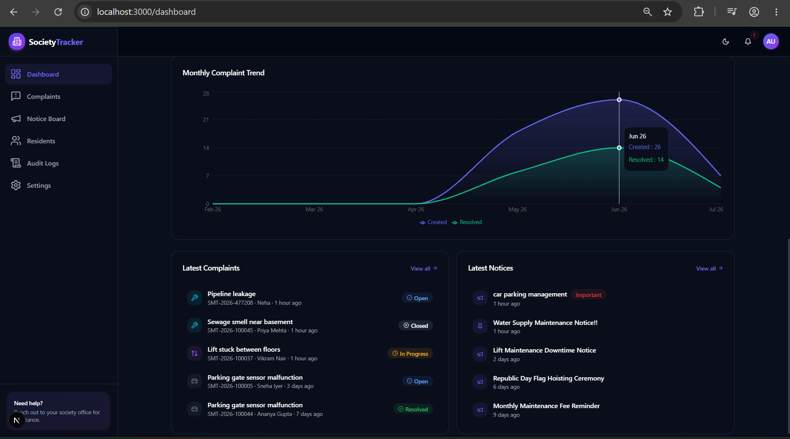
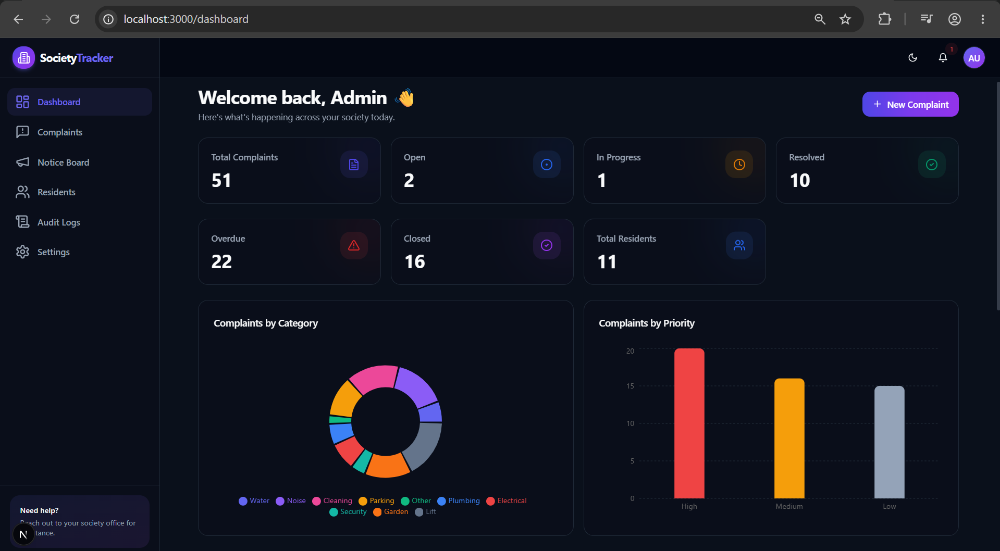
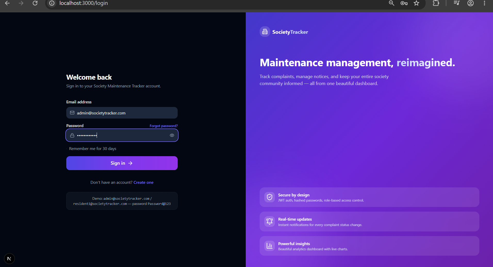
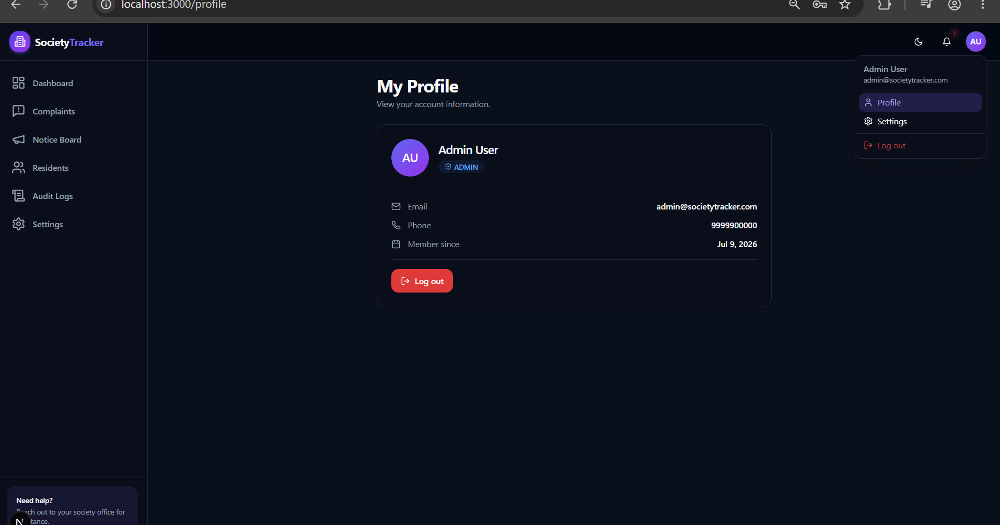
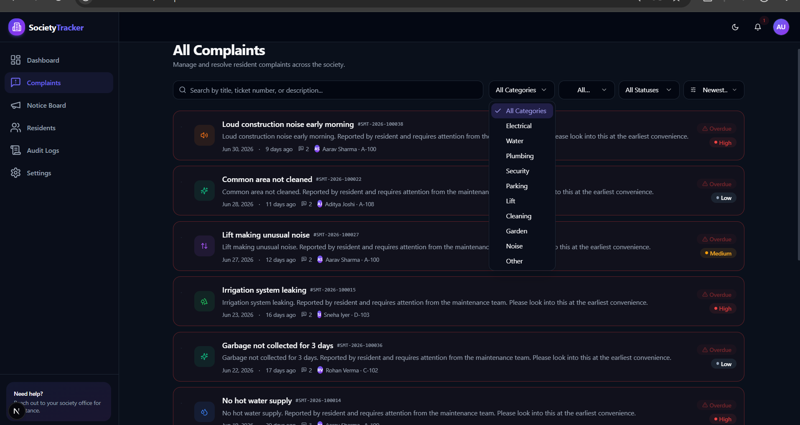

<<<<<<< HEAD
<div align="center">

# 🏢 Society Maintenance Tracker

### The modern, production-grade platform for apartment & society complaint management

**Residents raise issues. Admins resolve them. Everyone stays informed — automatically.**

Built with a premium SaaS-grade UI/UX inspired by Linear, Notion, and the Vercel Dashboard — complete with dark/light themes, buttery animations, real-time-style notifications, analytics dashboards, and automated overdue detection.

<br />

[](https://nextjs.org/)
[](https://react.dev/)
[](https://www.typescriptlang.org/)
[](https://expressjs.com/)
[](https://www.postgresql.org/)
[](https://www.prisma.io/)
[](https://tailwindcss.com/)
[](https://jwt.io/)
[](#-production-build)
[](https://github.com/YOUR_USERNAME/society-maintenance-tracker/commits/main)
[](#-license)

<br />

[Features](#-features) · [Screenshots](#-screenshots) · [Tech Stack](#-tech-stack) · [Installation](#-installation) · [Architecture](#-architecture) · [API](#-api-overview) · [Deployment](#️-deployment)

</div>

---

## 🖼️ Project Preview

<div align="center">

**Banner**



| Dashboard | Login |
|---|---|
|  |  |

| Admin Panel | Analytics |
|---|---|
|  |  |

| Dark Mode | Mobile View |
|---|---|
|  |  |

> 📸 *All images above are placeholders — drop your real screenshots into `docs/screenshots/` with the matching filenames and they'll render automatically.*

</div>

---

## 📖 About the Project

**Society Maintenance Tracker** solves a problem every apartment complex knows well: maintenance complaints get lost in WhatsApp groups, phone calls, and paper registers.

This platform gives **Residents** a clean, guided way to raise a complaint — with photos, category, and priority — and track its entire lifecycle from submission to resolution. **Admins** get a powerful control center to triage, assign, prioritize, and resolve every complaint in the society, with nothing slipping through the cracks.

> 🔁 **Complaint Lifecycle** — every complaint moves through a fully-audited state machine (`Open → In Progress → Resolved → Closed`, with automatic `Overdue` escalation), and every single transition is permanently recorded in a timeline.
>
> 🤖 **Automation** — a background cron job continuously scans for complaints that have breached their configurable SLA and flags them as overdue, no manual intervention required.
>
> 🔔 **Notifications** — residents and admins are kept in the loop through in-app notifications and branded HTML emails at every key milestone.
>
> 📊 **Analytics** — role-aware dashboards turn raw complaint data into actionable insight: category breakdowns, priority distribution, monthly trends, and recent activity — at a glance.

The result: faster resolutions, full transparency, and a paper trail for every decision made.
=======
Rewrite my README.md completely.

The project is already complete. Do NOT change any code, folders, configuration files, or documentation. Only rewrite README.md.

I want a world-class GitHub README that looks like a premium open-source project similar to Vercel, Supabase, Appwrite, Cal.com, Payload CMS, or shadcn/ui.
>>>>>>> a3b6eb2bbadc375edd54ac9a61ac14117d017b2f

The README should be visually attractive, interactive, professional, and recruiter-friendly.

Requirements:

<<<<<<< HEAD
<details open>
<summary><strong>🔐 Authentication</strong></summary>

<br />

| Capability | Details |
|---|---|
| Resident Registration | Self-serve sign-up with name, email, password, phone, flat number, block |
| Resident & Admin Login | Single login endpoint, role resolved from the database |
| JWT Access + Refresh Tokens | Short-lived access token + long-lived `httpOnly` refresh cookie |
| Automatic Token Refresh | Axios interceptor transparently refreshes expired access tokens |
| Forgot / Reset Password | Secure, time-limited reset tokens emailed to the user |
| Remember Me | Extends refresh token lifetime on login |
| Protected Routes | Route-guard component redirects unauthenticated users |
| Role-Based Access Control | Fine-grained `RESIDENT` / `ADMIN` middleware on every sensitive route |
| Secure Sessions | Password hashing with bcrypt, `httpOnly` + `SameSite` cookies |
| Logout | Revokes refresh token server-side and clears the cookie |

</details>

<details open>
<summary><strong>📝 Complaint Management</strong></summary>

<br />

| Capability | Details |
|---|---|
| Create Complaint | Title, description, category, priority, up to multiple photos |
| Edit Complaint | Allowed only while status is `OPEN` (locked after admin action) |
| Delete Complaint | Resident can delete before any admin processing |
| Categories | Electrical · Water · Plumbing · Security · Parking · Lift · Cleaning · Garden · Noise · Other |
| Priorities | Low · Medium · High |
| Statuses | Open · In Progress · Resolved · Closed · Overdue |
| Image Upload | Multiple images per complaint via Cloudinary, with preview & removal |
| Search & Filter | By ticket ID, resident, category, priority, status, date range |
| Sorting | Newest, oldest, priority, status |
| Pagination | Server-side, configurable page size |
| Complaint Timeline | Full status/priority history with actor, timestamp, and notes |
| Complaint Details Page | Rich detail view with image gallery and admin action panel |

</details>

<details open>
<summary><strong>🛠️ Admin Dashboard</strong></summary>

<br />

| Capability | Details |
|---|---|
| View All Complaints | Society-wide list with search, filter, sort, pagination |
| Assign Priority | Change priority with reason captured in history |
| Update Status | Move complaints through the lifecycle with audit trail |
| Assign Staff | Assign a complaint to an admin/staff member |
| Internal Notes | Admin-only notes not visible to residents |
| Bulk Actions | Bulk delete, bulk status update, bulk priority update |
| Complaint History | Full read-only audit of every change made |
| Resident Management | View, search, and suspend/activate resident accounts |
| Dashboard Statistics | Society-wide KPIs and charts |

</details>

<details open>
<summary><strong>🔔 Notifications</strong></summary>

<br />

| Capability | Details |
|---|---|
| In-App Notification Center | Dropdown with live unread badge |
| Mark as Read | Single or "mark all as read" |
| Resident Notifications | Status changes, resolutions, notices, password resets |
| Admin Notifications | New complaints, overdue escalations |
| Polling Updates | Lightweight polling for a real-time feel without WebSockets |

</details>

<details open>
<summary><strong>📢 Notice Board</strong></summary>

<br />

| Capability | Details |
|---|---|
| Create / Edit / Delete Notice | Full CRUD for admins |
| Pin Notice | Pinned notices always sort to the top |
| Mark Important | Visually highlighted important notices |
| Resident View | Read-only, beautifully-styled notice cards |
| Email Broadcast | Optional email notification when an important notice is posted |

</details>

<details open>
<summary><strong>📈 Analytics</strong></summary>

<br />

| Capability | Details |
|---|---|
| Total / Resolved / Pending / Overdue | Real-time stat cards |
| By Category | Pie chart breakdown |
| By Priority | Bar chart breakdown |
| Monthly Trend | Area/line chart of complaint volume over time |
| Recent Complaints & Notices | Latest activity feeds |
| Role-Aware | Admin sees society-wide data, residents see personal stats |

</details>

<details open>
<summary><strong>✉️ Email System</strong></summary>

<br />

| Capability | Details |
|---|---|
| Complaint Created | Confirmation email to the resident |
| Status Changed | Notifies resident of any status transition |
| Complaint Resolved | Resolution confirmation with summary |
| Important Notice Posted | Broadcast email to residents |
| Password Reset | Secure reset link with expiry |
| HTML Templates | Branded, responsive email layout via Nodemailer |
| Email Logs | Every send attempt logged with status (`SENT` / `FAILED` / `PENDING`) |

</details>

<details open>
<summary><strong>🧾 Audit Logs</strong></summary>

<br />

| Capability | Details |
|---|---|
| Action Logging | Every admin action (status change, delete, bulk action) recorded |
| Actor Tracking | Records the user who performed the action |
| Metadata & IP | Stores contextual metadata and request IP address |
| Admin-Only View | Searchable, paginated audit trail page |

</details>

<details open>
<summary><strong>⏰ Overdue Detection</strong></summary>

<br />

| Capability | Details |
|---|---|
| Configurable Thresholds | Separate SLA (in days) per priority — Low / Medium / High |
| Automatic Detection | Hourly cron job flags breached complaints as `OVERDUE` |
| Visual Highlighting | Overdue complaints surfaced in red and sorted to the top |
| Live Dashboard Counter | Overdue stat card updates automatically |

</details>

<details open>
<summary><strong>🎨 UI / UX</strong></summary>

<br />

| Capability | Details |
|---|---|
| Dark / Light Mode | System-aware theme with manual toggle |
| Animations | Framer Motion micro-interactions and page transitions |
| Skeleton Loaders | Every async view has a matching loading skeleton |
| Empty & Error States | Thoughtful, illustrated states for every list/page |
| Toast Notifications | Non-blocking success/error feedback |
| Confirmation Dialogs | Guard rails on every destructive action |
| Responsive Design | Mobile, tablet, and desktop optimized |
| Custom 404 / Error Pages | Branded, on-theme fallback pages |

</details>

<details open>
<summary><strong>⚡ Performance</strong></summary>

<br />

| Capability | Details |
|---|---|
| Server-Side Pagination | Only fetch what's rendered |
| TanStack Query Caching | Deduplication, background refetch, stale-while-revalidate |
| Next.js App Router | Streaming, partial rendering, route-level code splitting |
| Indexed Queries | Postgres indexes on every frequently filtered column |
| Optimized Images | Cloudinary transformation + Next.js `Image` component |

</details>

<details open>
<summary><strong>🛡️ Security</strong></summary>

<br />

| Capability | Details |
|---|---|
| JWT Authentication | Signed access + refresh tokens |
| bcrypt | Salted password hashing |
| Helmet | Secure HTTP headers |
| Rate Limiting | `express-rate-limit` on sensitive endpoints |
| CORS | Strict origin allow-listing |
| Input Sanitization | `sanitize-html` + Zod schema validation |
| SQL Injection Protection | Prisma parameterized queries |
| XSS Protection | Output encoding + sanitization |
| CSRF Considerations | `httpOnly`/`SameSite` cookies, bearer tokens for state-changing calls |

</details>

Full checklist: see [`docs/FEATURES.md`](./docs/FEATURES.md).
=======
• Keep ALL existing information from the current README.
• Do not remove any feature.
• Do not remove any setup steps.
• Keep all deployment instructions.
• Keep documentation links.
• Keep environment variable instructions.
• Keep GitHub submission checklist.

Instead of the current simple layout, redesign it beautifully.
>>>>>>> a3b6eb2bbadc375edd54ac9a61ac14117d017b2f

Include:

# Hero Section

<<<<<<< HEAD
<table>
<tr><td valign="top" width="50%">

**Frontend**

| Technology | Purpose |
|---|---|
| Next.js 15 | App Router, SSR/streaming |
| React 18 | UI library |
| TypeScript | Type safety |
| Tailwind CSS | Utility-first styling |
| shadcn-style components | Accessible UI primitives |
| Lucide Icons | Iconography |

**State Management**

| Technology | Purpose |
|---|---|
| TanStack Query | Server state, caching, refetching |
| React Context | Auth & theme state |

**Validation**

| Technology | Purpose |
|---|---|
| React Hook Form | Performant form state |
| Zod | Schema validation (client + server) |

</td><td valign="top" width="50%">

**Backend**

| Technology | Purpose |
|---|---|
| Node.js | Runtime |
| Express.js | REST API framework |
| TypeScript | Type safety |

**Database & ORM**

| Technology | Purpose |
|---|---|
| PostgreSQL | Relational database |
| Prisma | Type-safe ORM, migrations |

**Authentication**

| Technology | Purpose |
|---|---|
| JWT | Access + refresh tokens |
| bcrypt | Password hashing |

**Charts & Animation**

| Technology | Purpose |
|---|---|
| Recharts | Pie / bar / area charts |
| Framer Motion | Animations & transitions |

**Deployment**

| Layer | Platform |
|---|---|
| Frontend | Vercel |
| Backend | Render / Railway |
| Database | Neon PostgreSQL |
| Images | Cloudinary |

</td></tr>
</table>
=======
A beautiful centered title.
>>>>>>> a3b6eb2bbadc375edd54ac9a61ac14117d017b2f

Project tagline.

Short introduction.

<<<<<<< HEAD
<details open>
<summary><strong>Click to expand the full monorepo layout</strong></summary>

```
society-maintenance-tracker/
├── apps/
│   ├── backend/                     🚀 Express + TypeScript API
│   │   ├── prisma/
│   │   │   ├── schema.prisma        📐 Database schema
│   │   │   └── seed.ts              🌱 Seed script
│   │   └── src/
│   │       ├── config/              ⚙️  env, db, cloudinary, logger
│   │       ├── middlewares/         🛡️  auth, roles, validation, rate-limit, errors, upload
│   │       ├── modules/             📦 feature modules
│   │       │   └── <module>/        ├─ *.routes.ts
│   │       │                        ├─ *.controller.ts
│   │       │                        ├─ *.service.ts
│   │       │                        ├─ *.repository.ts
│   │       │                        └─ *.dto.ts
│   │       │   ├── auth/
│   │       │   ├── complaints/
│   │       │   ├── notices/
│   │       │   ├── notifications/
│   │       │   ├── dashboard/
│   │       │   ├── users/
│   │       │   └── settings/
│   │       ├── services/            ✉️  email, cloudinary, token services
│   │       ├── templates/           🎨 HTML email templates
│   │       ├── jobs/                ⏰ overdue-detection cron
│   │       ├── utils/               🧰 ApiError, ApiResponse, pagination, audit log
│   │       ├── routes/              🗺️  root router
│   │       ├── app.ts
│   │       └── server.ts
│   │
│   └── frontend/                    🎨 Next.js 15 App Router
│       └── src/
│           ├── app/                 🧭 routes — (auth) & (dashboard) route groups
│           ├── components/          🧩 ui/, layout/, complaints/, notices/, dashboard/, shared/
│           ├── hooks/                🪝 TanStack Query hooks
│           ├── lib/                  📚 api client, services, validators, types, utils
│           └── providers/            🌗 theme, query, auth providers
│
├── docs/                             📖 API docs, ER diagram, architecture, deployment, system design
├── package.json                      📦 npm workspaces root
└── .gitignore
```

</details>

---

## 🏛️ Architecture

<div align="center">

```
                         ┌───────────────────────────┐
                         │        Next.js 15         │
                         │   (React · TypeScript)    │
                         │  App Router · TanStack Q   │
                         └─────────────┬─────────────┘
                                       │  REST (JSON) + Bearer JWT
                                       ▼
                         ┌───────────────────────────┐
                         │       Backend API          │
                         │  Express.js · TypeScript   │
                         │ Controllers·Services·Repos │
                         └───────┬───────────┬────────┘
                                 │           │
                        ┌────────▼──┐   ┌────▼─────────┐
                        │  Prisma   │   │  Cloud Services│
                        │   ORM     │   │               │
                        └────┬──────┘   │  ┌──────────┐ │
                             │          │  │Cloudinary│ │  images
                             ▼          │  └──────────┘ │
                     ┌───────────────┐  │  ┌──────────┐ │
                     │  PostgreSQL   │  │  │   SMTP   │ │  emails
                     │  (Neon)       │  │  └──────────┘ │
                     └───────────────┘  └───────────────┘
```

</div>

> See [`docs/ARCHITECTURE.md`](./docs/ARCHITECTURE.md) for the detailed request-flow diagrams and [`docs/SYSTEM_DESIGN.md`](./docs/SYSTEM_DESIGN.md) for the full ~800-word design write-up.

---

## 🔄 Complaint Workflow

<div align="center">

```
   👤 Resident
      │
      ▼
 📝 Create Complaint  ──────────────► status: OPEN
      │
      ▼
 🔍 Admin Review
      │
      ▼
 🏷️  Assigned          ──────────────► priority set · staff assigned
      │
      ▼
 🔧 In Progress        ──────────────► status: IN_PROGRESS
      │
      ├──────────────► ⏰ Overdue (if SLA breached — auto-detected)
      │
      ▼
 ✅ Resolved           ──────────────► status: RESOLVED · resident notified
      │
      ▼
 🔒 Closed             ──────────────► status: CLOSED
```

**Every arrow above is a recorded transition** — old status, new status, timestamp, acting admin, and notes are all written to `ComplaintHistory` and rendered as a beautiful timeline on the complaint detail page.

</div>

---

## 📊 Dashboard Features

| Card / Widget | Description |
|---|---|
| 📌 Total Complaints | Society-wide (or personal, for residents) complaint count |
| ✅ Resolved | Count of complaints marked resolved |
| ⏳ Pending | Complaints currently open or in progress |
| 🔴 Overdue | Complaints that breached their SLA threshold |
| 🥧 By Category | Pie chart — Electrical, Water, Plumbing, Security, etc. |
| 📊 By Priority | Bar chart — Low / Medium / High distribution |
| 📈 Monthly Trend | Line/area chart of complaint volume over time |
| 🕐 Recent Complaints | Latest submissions across the society |
| 📢 Recent Notices | Latest published notices |

---

## 🛡️ Security Features

| Feature | Implementation |
|---|---|
| 🔑 JWT | Access + refresh token pair, signed with separate secrets |
| 👥 RBAC | Role middleware guarding `RESIDENT` vs `ADMIN` routes |
| 🔒 Password Hashing | bcrypt with per-user salt |
| 🚧 Protected Routes | Frontend route guard + backend auth middleware on every private endpoint |
| 🚦 Rate Limiting | `express-rate-limit` on auth & write-heavy routes |
| ✅ Validation | Zod schemas enforced on both client and server |
| 🪖 Helmet | Hardened HTTP response headers |
| 🌐 CORS | Explicit origin allow-list via `CLIENT_URL` |
| 🧼 Sanitization | `sanitize-html` strips unsafe input before persistence |

---

## 🔌 API Overview

> Base URL: `http://localhost:5000/api` · All responses follow a consistent `{ success, message, data, meta }` envelope.

<details open>
<summary><strong>🔐 Authentication — <code>/api/auth</code></strong></summary>

<br />

| Method | Endpoint | Auth | Description |
|---|---|---|---|
| `POST` | `/register` | Public | Register a new resident |
| `POST` | `/login` | Public | Login (resident or admin) |
| `POST` | `/refresh` | Cookie | Issue a new access token |
| `POST` | `/logout` | Bearer | Revoke refresh token & clear cookie |
| `POST` | `/forgot-password` | Public | Request a password reset email |
| `POST` | `/reset-password` | Public | Reset password with token |
| `GET` | `/me` | Bearer | Get current authenticated user |

</details>

<details open>
<summary><strong>📝 Complaints — <code>/api/complaints</code></strong></summary>

<br />

| Method | Endpoint | Auth | Description |
|---|---|---|---|
| `GET` | `/` | Bearer | List complaints (filter/search/sort/paginate) |
| `POST` | `/` | Bearer | Create complaint (multipart, images[]) |
| `GET` | `/:id` | Bearer | Get complaint with history & images |
| `PATCH` | `/:id` | Owner | Edit complaint (while `OPEN`) |
| `DELETE` | `/:id` | Owner/Admin | Delete complaint |
| `PATCH` | `/:id/admin` | Admin | Update status/priority/assignee/notes |
| `POST` | `/bulk` | Admin | Bulk delete / set status / set priority |

</details>

<details open>
<summary><strong>📊 Dashboard — <code>/api/dashboard</code></strong></summary>

<br />

| Method | Endpoint | Auth | Description |
|---|---|---|---|
| `GET` | `/stats` | Bearer | Role-aware statistics & chart data |

</details>

<details open>
<summary><strong>👥 Users — <code>/api/users</code></strong> <em>(Admin only)</em></summary>

<br />

| Method | Endpoint | Description |
|---|---|---|
| `GET` | `/` | Paginated list of all users |
| `GET` | `/residents` | List residents (search/autocomplete) |
| `GET` | `/admins` | List admins (for assignment) |
| `PATCH` | `/:id/toggle-active` | Suspend/activate a user |

</details>

<details open>
<summary><strong>🔔 Notifications — <code>/api/notifications</code></strong></summary>

<br />

| Method | Endpoint | Auth | Description |
|---|---|---|---|
| `GET` | `/` | Bearer | List notifications |
| `GET` | `/unread-count` | Bearer | Unread count |
| `PATCH` | `/:id/read` | Bearer | Mark one as read |
| `PATCH` | `/read-all` | Bearer | Mark all as read |

</details>

<details open>
<summary><strong>⚙️ Settings — <code>/api/settings</code></strong> <em>(Admin only)</em></summary>

<br />

| Method | Endpoint | Description |
|---|---|---|
| `GET` | `/priority` | Get overdue thresholds per priority |
| `PUT` | `/priority` | Update overdue threshold |

</details>

<details>
<summary><strong>📢 Notices &amp; 🧾 Audit Logs &amp; ❤️ Health</strong></summary>

<br />

| Method | Endpoint | Auth | Description |
|---|---|---|---|
| `GET` | `/api/notices` | Bearer | List notices (pinned first) |
| `POST` | `/api/notices` | Admin | Create notice |
| `GET` | `/api/notices/:id` | Bearer | Get single notice |
| `PATCH` | `/api/notices/:id` | Admin | Update notice |
| `PATCH` | `/api/notices/:id/pin` | Admin | Toggle pinned state |
| `DELETE` | `/api/notices/:id` | Admin | Delete notice |
| `GET` | `/api/audit-logs` | Admin | Paginated audit trail |
| `GET` | `/api/health` | Public | Health check |

</details>

📚 Full parameter-level reference: [`docs/API_DOCUMENTATION.md`](./docs/API_DOCUMENTATION.md) · Ready-to-import [Postman collection](./docs/postman_collection.json).

---

## 🚀 Installation
=======
Beautiful emoji usage.

Professional badges using shields.io including:

- Next.js
- React
- TypeScript
- Express
- PostgreSQL
- Prisma
- TailwindCSS
- JWT
- License
- Build Status
- Last Commit
>>>>>>> a3b6eb2bbadc375edd54ac9a61ac14117d017b2f

Navigation links:

<<<<<<< HEAD
- ✅ Node.js ≥ 18.18
- ✅ A PostgreSQL database (local, Docker, or [Neon](https://neon.tech) free tier)
- ⬜ (Optional) Cloudinary account for image uploads
- ⬜ (Optional) SMTP credentials (e.g. Gmail App Password) for emails

### 1️⃣ Install dependencies
=======
• Features
• Screenshots
• Tech Stack
• Installation
• Architecture
• API
• Deployment

------------------------------------------------
>>>>>>> a3b6eb2bbadc375edd54ac9a61ac14117d017b2f

# Project Preview

<<<<<<< HEAD
### 2️⃣ Configure environment variables
=======
Add placeholders for:
>>>>>>> a3b6eb2bbadc375edd54ac9a61ac14117d017b2f

Banner

Dashboard Screenshot

<<<<<<< HEAD
### 3️⃣ Set up the database
=======
Login Screenshot
>>>>>>> a3b6eb2bbadc375edd54ac9a61ac14117d017b2f

Admin Screenshot

<<<<<<< HEAD
> The seed script creates:
>
> - 👑 1 admin (`admin@societytracker.com`)
> - 🧑‍🤝‍🧑 10 residents (`resident1@societytracker.com` … `resident10@societytracker.com`)
> - 📝 50 complaints across all categories/priorities/statuses
> - 📢 20 notices (some pinned, some marked important)
> - 🔑 All seeded users share the password: **`Password@123`**

### 4️⃣ Run the app
=======
Analytics Screenshot

Dark Mode Screenshot
>>>>>>> a3b6eb2bbadc375edd54ac9a61ac14117d017b2f

Mobile Screenshot

Write them as markdown image placeholders so I can replace them later.

<<<<<<< HEAD
Open **[http://localhost:3000](http://localhost:3000)** and log in with the seeded admin or resident credentials above. 🎉
=======
------------------------------------------------
>>>>>>> a3b6eb2bbadc375edd54ac9a61ac14117d017b2f

# About the Project

Explain what the project solves.

<<<<<<< HEAD
### Backend — `apps/backend/.env`
=======
Mention:
>>>>>>> a3b6eb2bbadc375edd54ac9a61ac14117d017b2f

Residents

<<<<<<< HEAD
> Full list with defaults: [`apps/backend/.env.example`](./apps/backend/.env.example)

### Frontend — `apps/frontend/.env`
=======
Admins

Complaint lifecycle
>>>>>>> a3b6eb2bbadc375edd54ac9a61ac14117d017b2f

Automation

<<<<<<< HEAD
> ⚠️ **Never commit your real `.env` files.** Only `.env.example` should be tracked in Git.

---

## 🗄️ Database

Normalized PostgreSQL schema managed with **Prisma migrations**. All relations use foreign keys with `onDelete` behavior, and every frequently-queried column is indexed.

| Model | Purpose |
|---|---|
| `User` | Residents & admins — credentials, profile, role, refresh/reset tokens |
| `Complaint` | Core complaint record — title, description, category, priority, status, resident, assignee |
| `ComplaintImage` | Cloudinary-hosted images attached to a complaint |
| `ComplaintHistory` | Immutable audit trail of every status/priority change, with actor & notes |
| `Notice` | Notice board posts — pinned/important flags, author |
| `Notification` | In-app notifications per user, linked to a complaint where relevant |
| `EmailLog` | Record of every email attempt with delivery status |
| `PrioritySettings` | Per-priority configurable overdue threshold (days) |
| `SystemSetting` | Generic key-value store for global app configuration |
| `AuditLog` | Admin action trail — action, entity, metadata, IP address |

**Enums:** `Role` (`RESIDENT`/`ADMIN`) · `ComplaintCategory` (10 categories) · `ComplaintPriority` (`LOW`/`MEDIUM`/`HIGH`) · `ComplaintStatus` (`OPEN`/`IN_PROGRESS`/`RESOLVED`/`CLOSED`/`OVERDUE`) · `NotificationType` · `EmailStatus`

> Full entity-relationship diagram: [`docs/ER_DIAGRAM.md`](./docs/ER_DIAGRAM.md)

---

## 📸 Screenshots

| | |
|---|---|
| **Desktop** |  |
| **Dark Mode** |  |
| **Mobile** |  |
| **Dashboard** |  |
| **Analytics** |  |

> Replace the placeholders in `docs/screenshots/` — see [`docs/SCREENSHOTS.md`](./docs/SCREENSHOTS.md) for the exact filenames expected.

---
=======
Notifications
>>>>>>> a3b6eb2bbadc375edd54ac9a61ac14117d017b2f

Analytics

<<<<<<< HEAD
| Document | Description |
|---|---|
| 📘 [API Documentation](./docs/API_DOCUMENTATION.md) | Every endpoint, parameters, and response shapes |
| 📮 [Postman Collection](./docs/postman_collection.json) | Ready-to-import API collection |
| 🗺️ [ER Diagram](./docs/ER_DIAGRAM.md) | Full database schema & relationships |
| 🏛️ [Architecture Overview](./docs/ARCHITECTURE.md) | System architecture & request-flow diagrams |
| 🧠 [System Design Write-up](./docs/SYSTEM_DESIGN.md) | ~800-word deep dive into design decisions |
| ☁️ [Deployment Guide](./docs/DEPLOYMENT.md) | Step-by-step Vercel / Render / Neon deployment |
| ✅ [Feature Checklist](./docs/FEATURES.md) | Full list of implemented features |
| 🖼️ [Screenshots Guide](./docs/SCREENSHOTS.md) | Expected screenshot filenames & placement |
=======
------------------------------------------------
>>>>>>> a3b6eb2bbadc375edd54ac9a61ac14117d017b2f

# Features

Instead of bullets, organize features into modern tables.

<<<<<<< HEAD
- 🔐 **Auth** — register a new resident, log in as admin/resident, test forgot/reset password.
- 📝 **Complaints** — create a complaint with photos, edit/delete while `OPEN`, watch it become locked after an admin action.
- 🛠️ **Admin** — change status/priority, assign, add internal notes, try bulk actions, delete a complaint.
- ⏰ **Overdue** — lower a priority's threshold to a small number of days in **Admin → Settings**, wait for the hourly cron (or temporarily adjust the cron schedule) to see complaints flip to `OVERDUE`.
- 📢 **Notices** — publish, pin, mark important, edit, delete as admin; view as resident.
- 🔔 **Notifications** — trigger any of the above and check the bell icon dropdown.
- 📊 **Dashboard** — verify stat cards and charts update as data changes.
=======
Sections:
>>>>>>> a3b6eb2bbadc375edd54ac9a61ac14117d017b2f

Authentication

Complaint Management

Admin Dashboard

<<<<<<< HEAD
> ✅ Both apps are verified to build and lint cleanly with **zero errors and zero warnings**.
=======
Notifications
>>>>>>> a3b6eb2bbadc375edd54ac9a61ac14117d017b2f

Notice Board

Analytics

<<<<<<< HEAD
See the full [Deployment Guide](./docs/DEPLOYMENT.md) for step-by-step instructions.

| Layer | Platform |
|---|---|
| 🎨 Frontend | [Vercel](https://vercel.com) |
| 🚀 Backend | [Render](https://render.com) or [Railway](https://railway.app) |
| 🗄️ Database | [Neon PostgreSQL](https://neon.tech) |

---

## 🗺️ Roadmap

> Planned enhancements for future iterations — not yet implemented.

- [ ] 🤖 AI Complaint Categorization
- [ ] 🧠 AI Complaint Summarization
- [ ] ⚡ Real-time Notifications via WebSockets
- [ ] 📱 Progressive Web App (PWA) support
- [ ] 📲 Native Mobile App
- [ ] 🧾 OCR Bill Scanner
- [ ] 💬 WhatsApp Notifications
- [ ] 🚪 Visitor Management
- [ ] 💳 Maintenance Payments Integration

---

## 💡 Why this project?

Society Maintenance Tracker was built to demonstrate what a genuinely production-grade, full-stack SaaS application looks like — not a tutorial project, but a system engineered the way real teams ship software. It showcases a normalized relational schema with proper indexing and referential integrity, a layered backend architecture (controllers → services → repositories) with centralized error handling and structured logging, and a modern frontend built on server-aware data fetching, optimistic UX, and accessible, responsive design. Security, validation, automation (overdue detection via cron), and observability (audit logs, email logs) were treated as first-class concerns rather than afterthoughts. Whether you're evaluating this as a portfolio piece, a learning reference, or a starting point for a real deployment, every layer — database, API, UI, and DevOps — was built to the same standard you'd expect from a funded startup's MVP.

---

## 👤 Author

<div align="center">

**Built and maintained by [Your Name]**

[](https://github.com/YOUR_USERNAME)
[](https://linkedin.com/in/YOUR_LINKEDIN)
[](mailto:your.email@example.com)

</div>
=======
Email System

Audit Logs
>>>>>>> a3b6eb2bbadc375edd54ac9a61ac14117d017b2f

Overdue Detection

UI/UX

Performance

<<<<<<< HEAD
<details>
<summary><strong>🔧 Git commands to publish this repository</strong></summary>

<br />

```bash
# Initialize Git
git init

# Create main branch
git branch -M main

# Add all files
git add .

# Commit
git commit -m "Initial commit - Society Maintenance Tracker"

# Add remote (replace YOUR_USERNAME)
git remote add origin https://github.com/YOUR_USERNAME/society-maintenance-tracker.git

# Push code
git push -u origin main
```

</details>

---
=======
Security

------------------------------------------------

# Tech Stack
>>>>>>> a3b6eb2bbadc375edd54ac9a61ac14117d017b2f

Use attractive markdown tables.

<<<<<<< HEAD
This project is provided as-is for educational and evaluation purposes.

<div align="center">

<br />

**⭐ If this project helped you, consider giving it a star on GitHub!**

Made with ❤️ and a lot of ☕

</div>
=======
Frontend

Backend

Database

ORM

Authentication

Charts

State Management

Validation

Animation

Deployment

------------------------------------------------

# Folder Structure

Keep the current folder structure but redesign it beautifully.

------------------------------------------------

# Architecture

Create a clean ASCII architecture diagram.

Show:

Frontend

↓

Backend API

↓

Prisma

↓

PostgreSQL

Cloudinary

SMTP

------------------------------------------------

# Complaint Workflow

Create a visual workflow.

Resident

↓

Create Complaint

↓

Admin Review

↓

Assigned

↓

In Progress

↓

Resolved

↓

Closed

------------------------------------------------

# Dashboard Features

Create feature cards using markdown tables.

------------------------------------------------

# Security Features

JWT

RBAC

Password Hashing

Protected Routes

Rate Limiting

Validation

------------------------------------------------

# API Overview

Beautiful endpoint table.

Authentication

Complaints

Dashboard

Users

Notifications

Settings

------------------------------------------------

# Installation

Make it look modern.

Use numbered sections.

Use beautiful code blocks.

------------------------------------------------

# Environment Variables

Create beautiful tables.

Backend

Frontend

------------------------------------------------

# Database

Explain all Prisma models.

------------------------------------------------

# Screenshots

Create placeholders.

Desktop

Dark Mode

Mobile

Dashboard

Analytics

------------------------------------------------

# Documentation

Keep links.

Improve presentation.

------------------------------------------------

# Production Build

Keep build commands.

------------------------------------------------

# Deployment

Keep deployment instructions.

------------------------------------------------

# Roadmap

Add future features:

AI Complaint Categorization

AI Complaint Summarization

Real-time Notifications

WebSockets

PWA

Mobile App

OCR Bill Scanner

WhatsApp Notifications

Visitor Management

Maintenance Payments

------------------------------------------------

# Why this project?

Write a professional paragraph.

------------------------------------------------

# Author

Create a professional author section.

GitHub

LinkedIn placeholder

Email placeholder

------------------------------------------------

# License

Keep license.

------------------------------------------------

Formatting Requirements

Use:

- centered headings
- markdown tables
- emojis
- separators
- badges
- collapsible sections (<details>)
- blockquotes
- code blocks
- quote boxes
- checklist
- navigation links

The README should look like one of the best GitHub repositories.

Length should be around 600–900 lines.

Do NOT invent features that don't exist.

Do NOT remove any existing information.

Only improve presentation, structure, and visual appeal.
>>>>>>> a3b6eb2bbadc375edd54ac9a61ac14117d017b2f
