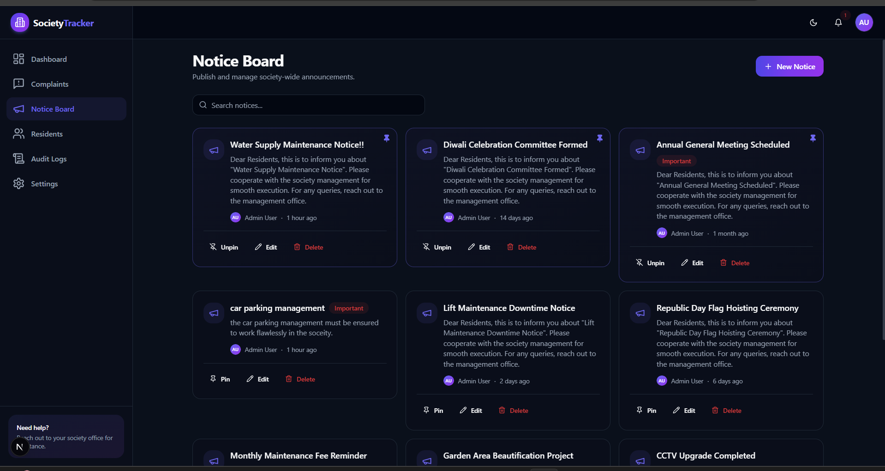
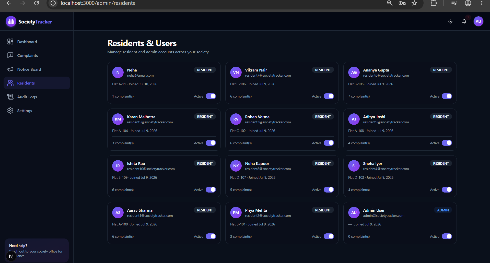

<div align="center">

# 🏢 Society Maintenance Tracker

### The modern, production-grade platform for apartment & society complaint management

**Residents raise issues. Admins resolve them. Everyone stays informed — automatically.**

Built with a premium SaaS-grade UI/UX inspired by Linear, Notion, and the Vercel Dashboard — complete with dark/light themes, buttery animations, real-time-style notifications, analytics dashboards, and automated overdue detection.

<br />

[](https://nextjs.org/)
[](https://react.dev/)
[](https://www.typescriptlang.org/)
[](https://expressjs.com/)
[](https://www.postgresql.org/)
[](https://www.prisma.io/)
[](https://tailwindcss.com/)
[](https://jwt.io/)
[](#-production-build)
[](https://github.com/YOUR_USERNAME/society-maintenance-tracker/commits/main)
[](#-license)

<br />

[Features](#-features) · [Screenshots](#-screenshots) · [Tech Stack](#-tech-stack) · [Installation](#-installation) · [Architecture](#-architecture) · [API](#-api-overview) · [Deployment](#️-deployment)

</div>

---
## 🖼️ Project Preview

<div align="center">

### 📊 Dashboard


| Banner | Login |
|--------|-------|
|  |  |

| Admin Panel | Complaints |
|-------------|------------|
|  |  |

| Notice Board | Residents |
|--------------|-----------|
|  |  |

</div>

---

## 📖 About the Project

**Society Maintenance Tracker** solves a problem every apartment complex knows well: maintenance complaints get lost in WhatsApp groups, phone calls, and paper registers.

This platform gives **Residents** a clean, guided way to raise a complaint — with photos, category, and priority — and track its entire lifecycle from submission to resolution. **Admins** get a powerful control center to triage, assign, prioritize, and resolve every complaint in the society, with nothing slipping through the cracks.

> 🔁 **Complaint Lifecycle** — every complaint moves through a fully-audited state machine (`Open → In Progress → Resolved → Closed`, with automatic `Overdue` escalation), and every single transition is permanently recorded in a timeline.
>
> 🤖 **Automation** — a background cron job continuously scans for complaints that have breached their configurable SLA and flags them as overdue, no manual intervention required.
>
> 🔔 **Notifications** — residents and admins are kept in the loop through in-app notifications and branded HTML emails at every key milestone.
>
> 📊 **Analytics** — role-aware dashboards turn raw complaint data into actionable insight: category breakdowns, priority distribution, monthly trends, and recent activity — at a glance.

Requirements:

<details open>
<summary><strong>🔐 Authentication</strong></summary>

<br />

| Capability | Details |
|---|---|
| Resident Registration | Self-serve sign-up with name, email, password, phone, flat number, block |
| Resident & Admin Login | Single login endpoint, role resolved from the database |
| JWT Access + Refresh Tokens | Short-lived access token + long-lived `httpOnly` refresh cookie |
| Automatic Token Refresh | Axios interceptor transparently refreshes expired access tokens |
| Forgot / Reset Password | Secure, time-limited reset tokens emailed to the user |
| Remember Me | Extends refresh token lifetime on login |
| Protected Routes | Route-guard component redirects unauthenticated users |
| Role-Based Access Control | Fine-grained `RESIDENT` / `ADMIN` middleware on every sensitive route |
| Secure Sessions | Password hashing with bcrypt, `httpOnly` + `SameSite` cookies |
| Logout | Revokes refresh token server-side and clears the cookie |

</details>

<details open>
<summary><strong>📝 Complaint Management</strong></summary>

<br />

| Capability | Details |
|---|---|
| Create Complaint | Title, description, category, priority, up to multiple photos |
| Edit Complaint | Allowed only while status is `OPEN` (locked after admin action) |
| Delete Complaint | Resident can delete before any admin processing |
| Categories | Electrical · Water · Plumbing · Security · Parking · Lift · Cleaning · Garden · Noise · Other |
| Priorities | Low · Medium · High |
| Statuses | Open · In Progress · Resolved · Closed · Overdue |
| Image Upload | Multiple images per complaint via Cloudinary, with preview & removal |
| Search & Filter | By ticket ID, resident, category, priority, status, date range |
| Sorting | Newest, oldest, priority, status |
| Pagination | Server-side, configurable page size |
| Complaint Timeline | Full status/priority history with actor, timestamp, and notes |
| Complaint Details Page | Rich detail view with image gallery and admin action panel |

</details>

<details open>
<summary><strong>🛠️ Admin Dashboard</strong></summary>

<br />

| Capability | Details |
|---|---|
| View All Complaints | Society-wide list with search, filter, sort, pagination |
| Assign Priority | Change priority with reason captured in history |
| Update Status | Move complaints through the lifecycle with audit trail |
| Assign Staff | Assign a complaint to an admin/staff member |
| Internal Notes | Admin-only notes not visible to residents |
| Bulk Actions | Bulk delete, bulk status update, bulk priority update |
| Complaint History | Full read-only audit of every change made |
| Resident Management | View, search, and suspend/activate resident accounts |
| Dashboard Statistics | Society-wide KPIs and charts |

</details>

<details open>
<summary><strong>🔔 Notifications</strong></summary>

<br />

| Capability | Details |
|---|---|
| In-App Notification Center | Dropdown with live unread badge |
| Mark as Read | Single or "mark all as read" |
| Resident Notifications | Status changes, resolutions, notices, password resets |
| Admin Notifications | New complaints, overdue escalations |
| Polling Updates | Lightweight polling for a real-time feel without WebSockets |

</details>

<details open>
<summary><strong>📢 Notice Board</strong></summary>

<br />

| Capability | Details |
|---|---|
| Create / Edit / Delete Notice | Full CRUD for admins |
| Pin Notice | Pinned notices always sort to the top |
| Mark Important | Visually highlighted important notices |
| Resident View | Read-only, beautifully-styled notice cards |
| Email Broadcast | Optional email notification when an important notice is posted |

</details>

<details open>
<summary><strong>📈 Analytics</strong></summary>

<br />

| Capability | Details |
|---|---|
| Total / Resolved / Pending / Overdue | Real-time stat cards |
| By Category | Pie chart breakdown |
| By Priority | Bar chart breakdown |
| Monthly Trend | Area/line chart of complaint volume over time |
| Recent Complaints & Notices | Latest activity feeds |
| Role-Aware | Admin sees society-wide data, residents see personal stats |

</details>

<details open>
<summary><strong>✉️ Email System</strong></summary>

<br />

| Capability | Details |
|---|---|
| Complaint Created | Confirmation email to the resident |
| Status Changed | Notifies resident of any status transition |
| Complaint Resolved | Resolution confirmation with summary |
| Important Notice Posted | Broadcast email to residents |
| Password Reset | Secure reset link with expiry |
| HTML Templates | Branded, responsive email layout via Nodemailer |
| Email Logs | Every send attempt logged with status (`SENT` / `FAILED` / `PENDING`) |

</details>

<details open>
<summary><strong>🧾 Audit Logs</strong></summary>

<br />

| Capability | Details |
|---|---|
| Action Logging | Every admin action (status change, delete, bulk action) recorded |
| Actor Tracking | Records the user who performed the action |
| Metadata & IP | Stores contextual metadata and request IP address |
| Admin-Only View | Searchable, paginated audit trail page |

</details>

<details open>
<summary><strong>⏰ Overdue Detection</strong></summary>

<br />

| Capability | Details |
|---|---|
| Configurable Thresholds | Separate SLA (in days) per priority — Low / Medium / High |
| Automatic Detection | Hourly cron job flags breached complaints as `OVERDUE` |
| Visual Highlighting | Overdue complaints surfaced in red and sorted to the top |
| Live Dashboard Counter | Overdue stat card updates automatically |

</details>

<details open>
<summary><strong>🎨 UI / UX</strong></summary>

<br />

| Capability | Details |
|---|---|
| Dark / Light Mode | System-aware theme with manual toggle |
| Animations | Framer Motion micro-interactions and page transitions |
| Skeleton Loaders | Every async view has a matching loading skeleton |
| Empty & Error States | Thoughtful, illustrated states for every list/page |
| Toast Notifications | Non-blocking success/error feedback |
| Confirmation Dialogs | Guard rails on every destructive action |
| Responsive Design | Mobile, tablet, and desktop optimized |
| Custom 404 / Error Pages | Branded, on-theme fallback pages |

</details>

<summary><strong>Click to expand the full monorepo layout</strong></summary>

```
society-maintenance-tracker/
├── apps/
│   ├── backend/                     🚀 Express + TypeScript API
│   │   ├── prisma/
│   │   │   ├── schema.prisma        📐 Database schema
│   │   │   └── seed.ts              🌱 Seed script
│   │   └── src/
│   │       ├── config/              ⚙️  env, db, cloudinary, logger
│   │       ├── middlewares/         🛡️  auth, roles, validation, rate-limit, errors, upload
│   │       ├── modules/             📦 feature modules
│   │       │   └── <module>/        ├─ *.routes.ts
│   │       │                        ├─ *.controller.ts
│   │       │                        ├─ *.service.ts
│   │       │                        ├─ *.repository.ts
│   │       │                        └─ *.dto.ts
│   │       │   ├── auth/
│   │       │   ├── complaints/
│   │       │   ├── notices/
│   │       │   ├── notifications/
│   │       │   ├── dashboard/
│   │       │   ├── users/
│   │       │   └── settings/
│   │       ├── services/            ✉️  email, cloudinary, token services
│   │       ├── templates/           🎨 HTML email templates
│   │       ├── jobs/                ⏰ overdue-detection cron
│   │       ├── utils/               🧰 ApiError, ApiResponse, pagination, audit log
│   │       ├── routes/              🗺️  root router
│   │       ├── app.ts
│   │       └── server.ts
│   │
│   └── frontend/                    🎨 Next.js 15 App Router
│       └── src/
│           ├── app/                 🧭 routes — (auth) & (dashboard) route groups
│           ├── components/          🧩 ui/, layout/, complaints/, notices/, dashboard/, shared/
│           ├── hooks/                🪝 TanStack Query hooks
│           ├── lib/                  📚 api client, services, validators, types, utils
│           └── providers/            🌗 theme, query, auth providers
│
├── docs/                             📖 API docs, ER diagram, architecture, deployment, system design
├── package.json                      📦 npm workspaces root
└── .gitignore
```

</details>

---

## 🔄 Complaint Workflow

<div align="center">

```
   👤 Resident
      │
      ▼
 📝 Create Complaint  ──────────────► status: OPEN
      │
      ▼
 🔍 Admin Review
      │
      ▼
 🏷️  Assigned          ──────────────► priority set · staff assigned
      │
      ▼
 🔧 In Progress        ──────────────► status: IN_PROGRESS
      │
      ├──────────────► ⏰ Overdue (if SLA breached — auto-detected)
      │
      ▼
 ✅ Resolved           ──────────────► status: RESOLVED · resident notified
      │
      ▼
 🔒 Closed             ──────────────► status: CLOSED
```

**Every arrow above is a recorded transition** — old status, new status, timestamp, acting admin, and notes are all written to `ComplaintHistory` and rendered as a beautiful timeline on the complaint detail page.

</div>

---
## 🚀 Installation
=======
- Next.js
- React
- TypeScript
- Express
- PostgreSQL
- Prisma
- TailwindCSS
- JWT
- License
- Build Status
- Last Commit

## 🗺️ Roadmap

> Planned enhancements for future iterations — not yet implemented.

- [ ] 🤖 AI Complaint Categorization
- [ ] 🧠 AI Complaint Summarization
- [ ] ⚡ Real-time Notifications via WebSockets
- [ ] 📱 Progressive Web App (PWA) support
- [ ] 📲 Native Mobile App
- [ ] 🧾 OCR Bill Scanner
- [ ] 💬 WhatsApp Notifications
- [ ] 🚪 Visitor Management
- [ ] 💳 Maintenance Payments Integration

---

## 💡 Why this project?

Society Maintenance Tracker was built to demonstrate what a genuinely production-grade, full-stack SaaS application looks like — not a tutorial project, but a system engineered the way real teams ship software. It showcases a normalized relational schema with proper indexing and referential integrity, a layered backend architecture (controllers → services → repositories) with centralized error handling and structured logging, and a modern frontend built on server-aware data fetching, optimistic UX, and accessible, responsive design. Security, validation, automation (overdue detection via cron), and observability (audit logs, email logs) were treated as first-class concerns rather than afterthoughts. Whether you're evaluating this as a portfolio piece, a learning reference, or a starting point for a real deployment, every layer — database, API, UI, and DevOps — was built to the same standard you'd expect from a funded startup's MVP.

---

## 👤 Author

<div align="center">

**Built and maintained by Neha Bhavsar**

</div>


