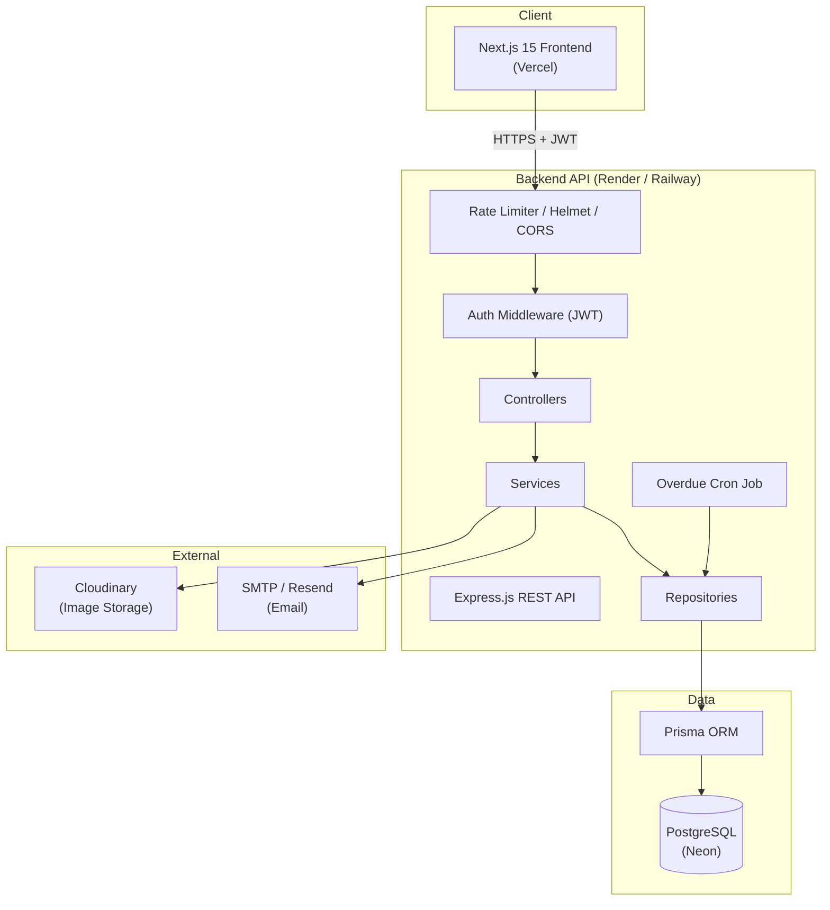

# Architecture Overview

## High-Level Architecture



## Request Flow

1. The Next.js client sends requests with an `Authorization: Bearer <accessToken>` header and `withCredentials` for the refresh cookie.
2. Requests hit Helmet, CORS, and rate-limiting middleware before reaching the router.
3. Protected routes run through `authenticate` (JWT verification) and `requireRole` (RBAC) middleware.
4. Controllers parse/validate input (Zod), delegate to services for business logic, and services call repositories for data access.
5. Repositories use Prisma Client to talk to PostgreSQL.
6. Side effects (email, notifications, Cloudinary uploads, audit logs) are triggered from the service layer.

## Layered Backend Structure

```
routes/  → HTTP method + path binding, middleware composition
controllers/ → request/response shaping, no business logic
services/ → business rules, orchestration, transactions
repositories/ → Prisma queries, isolated from business logic
dto/ (*.dto.ts) → Zod schemas used for validation + TS types
middlewares/ → auth, RBAC, error handling, rate limiting, uploads
```

## Frontend Structure

```
app/ → Next.js App Router routes (route groups for auth vs dashboard)
components/ui/ → shadcn-style primitives (button, card, dialog, ...)
components/{complaints,notices,dashboard,layout,shared}/ → feature components
lib/services/ → typed Axios wrappers per API resource
lib/validators/ → Zod schemas shared by React Hook Form
hooks/ → TanStack Query hooks (data fetching + caching + mutations)
providers/ → Theme, Query, Auth context providers
```

## Deployment Topology

- **Frontend** — Vercel, connected to `apps/frontend`, environment variable `NEXT_PUBLIC_API_URL` pointing to the deployed API.
- **Backend** — Render or Railway, connected to `apps/backend`, running `npm run build && npm run start` with `DATABASE_URL`, JWT secrets, Cloudinary and SMTP credentials as environment variables.
- **Database** — Neon PostgreSQL (serverless Postgres), migrations applied via `prisma migrate deploy` in the deployment pipeline.
