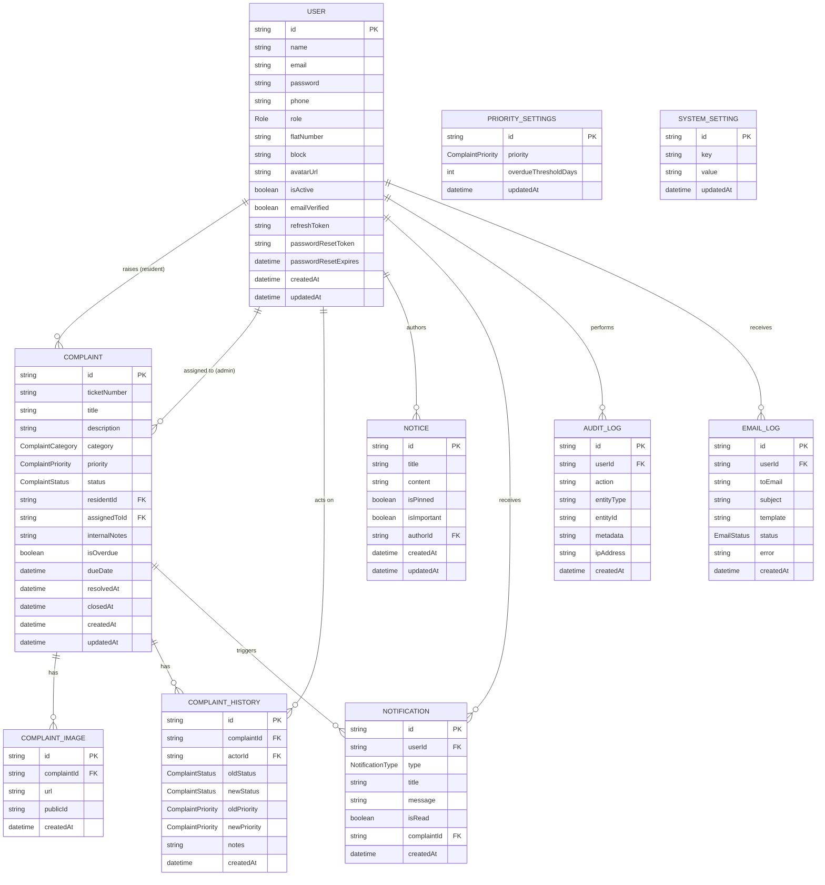

# Entity Relationship Diagram

## Notes

- `Role` enum: `RESIDENT`, `ADMIN`
- `ComplaintCategory` enum: `ELECTRICAL`, `WATER`, `PLUMBING`, `SECURITY`, `PARKING`, `LIFT`, `CLEANING`, `GARDEN`, `NOISE`, `OTHER`
- `ComplaintPriority` enum: `LOW`, `MEDIUM`, `HIGH`
- `ComplaintStatus` enum: `OPEN`, `IN_PROGRESS`, `RESOLVED`, `CLOSED`, `OVERDUE`
- `NotificationType` enum: `COMPLAINT_CREATED`, `COMPLAINT_STATUS_CHANGED`, `COMPLAINT_RESOLVED`, `COMPLAINT_OVERDUE`, `NOTICE_POSTED`, `PASSWORD_RESET`, `SYSTEM`
- `EmailStatus` enum: `SENT`, `FAILED`, `PENDING`
- All foreign keys are indexed; `Complaint.status`, `.priority`, `.category`, and `.isOverdue` carry additional indexes to support fast filtering on the complaints list.
